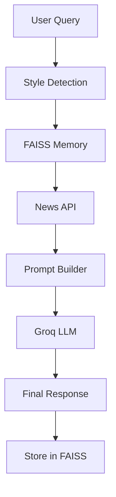

# 🧠 GenAI Real-Time News Assistant

An intelligent **GenAI-powered chatbot** that delivers **real-time news** using LLMs, APIs, and vector memory (RAG).

---

## 🚀 Features

* 🌐 Real-time news retrieval (News API)
* ⚡ Fast responses using Groq LLM
* 🧠 Memory with FAISS (RAG)
* 🎯 Multi-style output (bullets, summary, detailed)
* 🔗 LangChain-based orchestration
* ❌ Prevents hallucination using live data

---

## 🏗️ Architecture



---

## ⚙️ Tech Stack

* Python
* LangChain
* Groq API
* FAISS (Vector DB)
* NewsAPI
* Sentence Transformers

---

## ▶️ How to Run

```bash
git clone https://github.com/Sabari-5/GenAI-News-Assistant.git
cd GenAI-News-Assistant

pip install -r requirements.txt
```

Create `.env` file:

```
GROQ_API_KEY=your_key
NEWS_API_KEY=your_key
```

Run:

```bash
python app.py
```

---

## 💬 Example Output

**User:** latest AI news

**Bot:**

* OpenAI released new updates
* Google launched AI features
* AI startups raised funding
* Governments discussing regulations
* Adoption increasing globally

---

## 🧠 Key Concepts

* Retrieval-Augmented Generation (RAG)
* Vector Search (FAISS)
* Prompt Engineering
* Tool-based AI system

---

## ⚠️ Limitations

* Depends on API availability
* Slight delay in real-time data
* Free API rate limits

---

## 🚀 Future Improvements

* Streamlit UI
* Multi-agent architecture
* Deployment (AWS / Docker)
* Advanced query rewriting

---
## 💡 Highlights
- Built a real-time GenAI system combining APIs + LLM + vector memory
- Implemented RAG to improve response accuracy
- Designed prompt engineering for structured outputs

---
## 👨‍💻 Author

**Sabari R**
